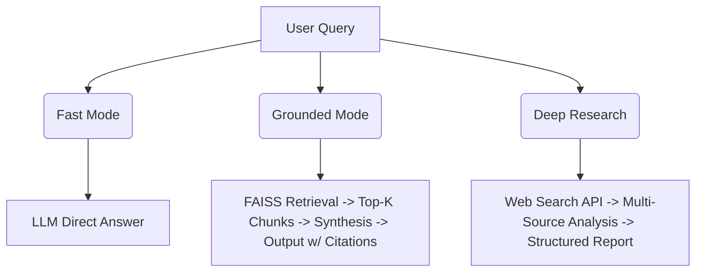

<div align="center">
  
  
  

  <h1>V.NOTEBOOK</h1>
  <p><strong>AI-Native Research Workspace & Assistant</strong></p>

  <p>
    An intelligent research workspace combining RAG-powered document analysis <br/>
    with a controlled execution engine for real-world actions.
  </p>

  <!-- IMPORTANT: Place a nice wide screenshot of your app here and name it "notebook-ui.png" inside an "assets" folder. -->
  
</div>

---

## 📖 Overview

**V.NOTEBOOK** is a full-stack AI workspace built from the ground up. It pairs a comprehensive research notebook (for uploading, querying, and analyzing documents via Retrieval-Augmented Generation) with **V.ASSISTANT** — a controlled execution system connecting directly to Gmail, Google Calendar, and WhatsApp. 

Crucially, it utilizes **mandatory human approval** before execution, ensuring that the AI assists you safely without making unauthorized decisions.

The project demonstrates advanced AI/ML engineering concepts including semantic routing, agentic function calling, RAG pipelines, human-in-the-loop safety, and OAuth-based API integrations.

---

## ✨ Key Features

| Feature | Description |
| :--- | :--- |
| 🗂️ **Multi-Mode Notebook** | Operate in *Fast Mode* (QA), *Grounded Mode* (RAG with citations), or *Deep Research* (web-augmented analysis). |
| 🔍 **RAG Pipeline** | Intelligent document pipeline: Upload PDFs → chunk → embed → index in FAISS → synthesize via LLM. |
| 🕸️ **Knowledge Graph** | Automatically maps out a NetworkX graph of entities and relationships from uploaded documents. |
| 🤖 **V.ASSISTANT** | Controlled execution engine translating natural language into structured actions across APIs. |
| 🛡️ **Human-in-the-Loop** | Every proposed action generates a preview card requiring explicit user approval before execution. |
| 📧 **Gmail Intelligence** | Advanced thread analysis, action-item detection, urgency scoring, and smart reply generation. |
| 🎯 **Goal Tracking** | Persistent sessions featuring automatic goal inference and progression from conversation context. |
| 🎙️ **Studio Tools** | Includes audio overview generation, auto-generated flashcards, mind maps, quizzes, and exports. |
| 🧠 **Cognitive Layer** | Features feedback memory, cross-session insight extraction, and progressive preference learning. |

<br>

<div align="center">
  <!-- IMPORTANT: Add a screenshot showing the assistant previewing an action card here -->
  
  <p><em>V.ASSISTANT requiring human approval before executing an action.</em></p>
</div>

---

## 🛠️ Technologies Used

### Backend Infrastructure
*   **Python 3.10+ & FastAPI**: Asynchronous API server with integrated lifespan events.
*   **Groq API (Llama-3.3-70b)**: Primary, high-speed LLM inference.
*   **OpenRouter**: Automatic failover configuration when primary API keys are exhausted.
*   **Sentence Transformers & FAISS**: Core pipeline for document embedding and rapid vector similarity search.
*   **NetworkX**: Applied for sophisticated knowledge graph construction.
*   **Google OAuth 2.0 APIs**: Secured endpoints for Gmail and Google Calendar handling.
*   **DuckDuckGo Search**: Web search module specifically empowering Deep Research mode.
*   **SpeechRecognition**: Real-time audio transcription capabilities.

### Frontend Architecture
*   **Vanilla HTML/CSS/JS**: Zero-framework, fully modular, and ultra-lightweight.
*   **Tailwind CSS (CDN)**: Clean, utility-first styling bound by custom design tokens.
*   **Material Design 3**: Unified iconography and design language execution.

---

## ⚙️ How It Works

### Research Notebook Pipeline


**Grounded Mode (RAG)** follows this specific execution flow:
1.  **Ingestion**: Document upload → text extraction → recursive chunking.
2.  **Embedding**: Chunks are processed via Sentence Transformers.
3.  **Indexing**: Generated embeddings correctly stored in a FAISS vector index.
4.  **Retrieval**: The user query is embedded → top-K nearest neighbor search triggers.
5.  **Synthesis**: Retrieved context correctly injected into the LLM system prompt for factual synthesis.

### V.ASSISTANT Execution Flow
```text
  User Request 
       │
       ▼
  Intent Parser         ── Extracts structured action (recipient, subject, body, etc.)
       │
       ▼
  Decision Engine       ── Routes to the correct handler (email, calendar, search)
       │
       ▼
  Action Queue          ── Writes action to local state with status: PENDING
       │
       ▼
  UI Preview Card       ── User reviews, edits, APPROVES, or CANCELS
       │
       ▼
  Executor              ── Calls the appropriate provider adapter (Gmail API, Calendar API)
       │
       ▼
  Audit Log             ── Resolves and records the result with timestamp & status
```

---

## 🚀 Setup & Installation

### Prerequisites
*   Python `3.10+` minimum.
*   An LLM API Key (Free tier at [Groq](https://console.groq.com) recommended).
*   *(Optional)* Google Cloud project with Gmail and Calendar APIs enabled.

> [!NOTE] 
> **Using Other LLM Providers:** The architecture is provider-agnostic. You can easily swap groq out for OpenAI, Anthropic, or local Ollama instances by editing a single file (`backend/core/llm.py`).

### 1. Clone & Install Environment
```bash
git clone https://github.com/VISVA-Ai/V.NOTEBOOK.git
cd V.NOTEBOOK
pip install -r requirements.txt
```

### 2. Configure Environment Variables
Copy over the environment template to begin setup:
```bash
cp .env.example .env
```
Populate `.env` with your secure keys:
```ini
# Required — LLM Provider 
GROQ_API_KEY=your_groq_api_key_here

# Optional — Additional keys for rate-limit rotation
GROQ_API_KEY_2=your_second_key_here
GROQ_API_KEY_3=your_third_key_here

# Optional — Fallback LLM Provider
OPENROUTER_API_KEY=your_openrouter_key_here
```

### 3. (Optional) Google API Credentials Setup
To utilize advanced intelligent email and calendar actions:
1.  Navigate to the [Google Cloud Console](https://console.cloud.google.com).
2.  Enable the **Gmail API** and **Google Calendar API**.
3.  Configure your **OAuth Consent Screen** (Desktop App).
4.  Generate an **OAuth Client ID** and download the credential JSON.
5.  Rename to `credentials.json` and place it natively the project root folder.
6.  *On your first startup, a browser window will trigger for manual OAuth authorization.*

### 4. Run the Application
Start the dedicated backend service:
```bash
cd backend
uvicorn main:app --reload --port 8000
```
Start the frontend interface *(in a new terminal tab)*:
```bash
cd frontend
python -m http.server 3000
```
Navigate to `http://localhost:3000` to interact with your workspace.

---

## 📁 Repository Structure

```text
V.NOTEBOOK/
├── backend/
│   ├── main.py                    # FastAPI unified app entry point
│   ├── api/                       # Categorized routing endpoints
│   ├── core/                      
│   │   ├── engine.py              # Central orchestrator 
│   │   ├── llm.py                 # Multi-key LLM handling wrapper 
│   │   ├── memory.py              # FAISS-backed vector store abstraction 
│   │   ├── decision_engine.py     # V.ASSISTANT intent routing & handling 
│   │   ├── executor.py            # Executable Action dispatching 
│   │   └── adapters/              # Modular API Connections (Gmail/Calendar)
│   └── models/                    # Pydantic structured schemas
├── frontend/
│   ├── index.html                 # Main SPA entry architecture
│   ├── css/                       # Modular UI stylesheets
│   └── js/
│       ├── notebook/              # Core Notebook logic scripts
│       └── assistant/             # V.ASSISTANT frontend modules
├── workflows/                     # Declarative n8n workflow templates
└── system_prompt.xml              # Global Constitution & Safety Prompt
```

---

## 🔒 Security Practices

> [!WARNING]
> **Your private API keys and OAuth tokens are NEVER committed to version control.**

This platform enforces a comprehensive local security standard:

| Asset | Protection Mechanism |
| :--- | :--- |
| **API Keys** | Secured in `.env` (automatically ignored by Git). |
| **Provider Credentials** | Read from local `credentials.json` exclusively. |
| **OAuth Access Tokens** | Isolated securely within `data/gmail_token.json`. |
| **Private Chat Sessions** | Constrained entirely to the local `data/` directory. |

---

## 🛠️ Advanced Concepts Demonstrated

*   **RAG Engineering**: End-to-end multi-pipeline embedding and retrieval with FAISS and dynamic system context injection.
*   **Semantic Routing**: Categorizes complex natural intent across completely different operational domains (Notebook vs. Assistant vs. Search).
*   **Agentic Function Calling**: Employs deterministic generation, effectively wrapping the LLM behavior to write to local execution queues.
*   **Idempotent Queue Management**: Guarantees zero double-submissions or crashes through atomic JSON state transitions (`Pending` → `Approved` → `Executed`).
*   **Human-in-the-Loop (HITL)**: Prioritizes absolute user supremacy over AI autonomy via the mandatory visual preview card approvals.
*   **Cognitive Learning Subsystem**: Runs isolated analysis tasks across legacy chat sessions to progressively update and adapt user personas.
*   **Intelligent Key Fallbacks**: Programmed grace degradation across exhausted API keys seamlessly jumping API providers on the backend.

---

## 📋 Known Limitations

*   **Settings Interface**: The header's settings gear icon and profile avatar remain aesthetic UI placeholders.
*   **WhatsApp Handling**: The existing WhatsApp adapter requires active Meta Business API validation; it defaults to disabled.
*   **Studio Modules**: Audio capabilities require active TTS integrations; video and mindmapping exist as stub architectures for future scaling.

---

<div align="center">
  <p>Available under the <strong>MIT License</strong> — see <a href="LICENSE">LICENSE</a> file directly for usage details.</p>
</div>
